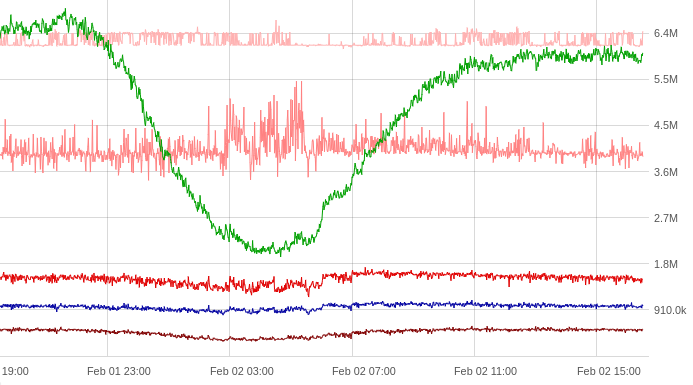

BTPD
=========

# Высокопроизводительный демон для сбора, аггрегации и хранения больших объемов статистических данных

На данный момент в продакшене на одном сервере принимается и агрегируется до 6.2 млн. значений в секунду (около полутриллиона в день) дня нескольких сотен тысяч счетчиков (графиков).

В хранилище на базе RocksDB сохраняются уже агрегированные данные, а сама агрегация производиться в реальном времени. Для каждого масштаба агрегации нужно настроить отдельное хранилище. У нас исторически используются: 5s, 1m, 7m, 1h, 1d (на графиках одна точка - это агрегация он пяти секунд до одного дня, соответственно). Для конкретных счетчиков процедур инициализации не предусмотрено, просто отправляете данные на сервер, графики появятся автоматически. К сожалению, инструментов для отображения графиков для btpd в свободном доступе нет и в ближайшее время не предвидится. Демон предоставляет JSON-RPC для построения графиков на базе собственных решений с использованием общедоступных библиотек.

* [Build](docs-md/build.md)
* [JSONRPC-API](docs-md/api.md)

## На github.com

* Репозитарий на [github.com](https://github.com/mambaru/btpd)
* Документация [doxygen](https://mambaru.github.io/btpd/index.html)
* Отчет [coverage](https://mambaru.github.io/btpd/cov-report/index.html)

