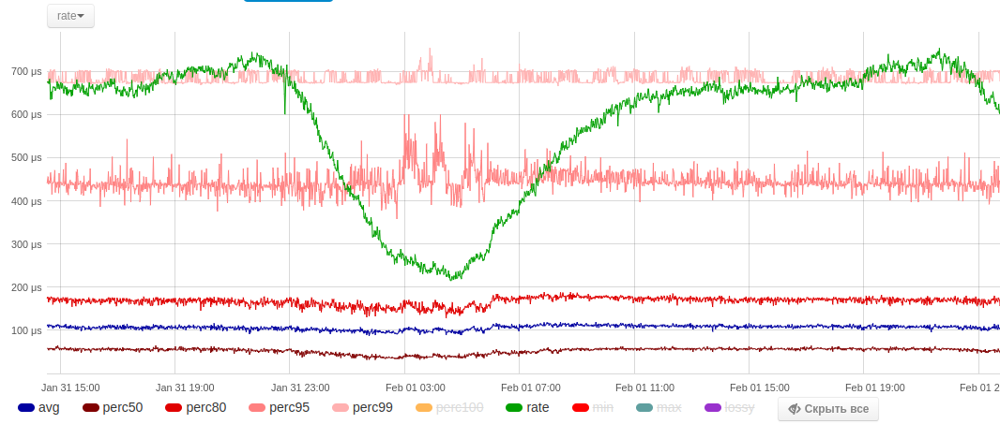

API агрегатора (входящий поток данных)
======
[[_TOC_]]

С помощью этих методов сервер принимает сырые или частично агрегированные данные на первичную обработку и сохранение. Для получения данных для отображения на графиках или анализа используйте [API хранилища](docs-md/api-ag.md).

Протокол взаимодействия - это текстовый JSONRPC сообщения разделенные символами \r\n по TCP/UDP. HTTP обвязки не используются. Можно подключиться к серверу по telnet и отправить сообщение на сервер составленное в простом текстовом редакторе и  получить ответ.

Пример JSONRPC запроса:
```json
{"jsonrpc":"2.0", "method":"push", "params":{ ... }, "id":1}
```
Пример JSONRPC ответа:
```json
{"jsonrpc":"2.0", "result":{ ... }, "id":1}
```
Здесь **id** - идентификатор запроса. Может быть любым, по нему определяется соответствие запросов и ответов при асинхронном взаимодействии.

Пример JSONRPC уведомления:
```json
{"jsonrpc":"2.0", "method":"push", "params":{ ... }}
```

Здесь и далее в описании методов будут приводиться только поля для **params** и **result**

## push

### push - первичная агрегация

Основной метод отправки данных на сервер. Как правило для этого используется UDP-протокол, TCP может использоваться для проверки, что система настроена правильно (должен прийти ответ без ошибок). По UDP-протокол сообщение также должно заканчиваться комбинацией \r\n.

```json
{
  "count": 0,
  "data":[0],
  "name":""
}
```

* **name** - имя счетчика. Может быть произвольным, но лучше придерживаться концепции [SSSO](ssso.md)
* **data** - сырые данные для счетчика в любых попугаях (как временные интервалы, так и размеры - любые числа)
* **count** - текущее значение счетчика. Если не указан, то принимается равным размеру массива **data**

Если нужно регистрировать разовые события, например время выполнения какого-либо скрипта или время выполнения запроса, то на сервер достаточно отправить имя счетчика и измеренное время выполнения:
```json
{"method":"push", "params":{"name":"script~~MyScript~~MyService~~MyOp", "data":[200]}}
```
Если посмотреть на любой график btp:



Здесь зеленый - это количество значений **data** зарегистрированных сервером (шт. в секунду или в шт. на данном масштабе агрегации). Это точное значение, по нему можно судить о числе событий в системе. А сами данные, после агрегации, сохраняются в виде перцентилей. Сам подсчет перцентилей не всегда идет на полном массиве данных, а после процедуры прореживания, поэтому, в общем, их нельзя считать абсолютно точными.

Если нам нужно регистрировать только число событий в системе (только зеленый график), то можно передавать только значения счетчика:
```json
{"method":"push", "params":{"name":"script~~MyScript~~MyService~~MyOp", "count":1}}
```
Количество событий и измеренных значений может не совпадать:
```json
{"method":"push", "params":{"name":"script~~MyScript~~MyService~~MyOp", "count":20,"data":[201, 240, 210, 232, 223]}}
```
Здесь у нас 20 событий, а измерили мы только 5 из них. Т.е. зеленый график у нас будет построен по сумме **count**, а перцентили из того что насобирает из **data**.

Если следовать концепции [SSSO](docs-md/ssso.md), то на самом деле нам нужно как минимум три счетчика:
```json
{"method":"push", "params":{"name":"script~~MyScript~~MyService~~MyOp", "data":[200]}}
{"method":"push", "params":{"name":"service~~MyService~~MyOp", "data":[200]}}
{"method":"push", "params":{"name":"service~~MyService~~MyServer~~MyOp", "data":[200]}}
```
Для отправки нескольких счетчиков лучше использовать метод [multi_push](#multi_push), который позволит сократить избыточность в именах и как следствие уменьшить трафик.

### push - вторичная агрегация

Этот вариант используется первичным агрегатором для передачи данных последующим в цепочке. Вы также можете его использовать, чтобы передать данные минуя первичный агрегатор, например если сделали самостоятельно проредили данные и понимаете, что вы делаете.

```json
{
  "count": 0,
  "lossy": 0,
  "min": 0,
  "max":0,
  "data":[0],
  "name":""
}
```

* **name** - имя счетчика. Может быть произвольным, но лучше придерживаться концепции [SSSO](docs-md/ssso.md)
* **data** - прореженные данные для счетчика
* **count** - значение счетчика. В данном контексте обязателен
* **min** - минимальное зарегистрированное значение в сырых данных до прореживания, а не из тех, что попали в **data**
* **max** - максимальное зарегистрированное значение в сырых данных до прореживания, а не из тех, что попали в **data**
* **lossy** - отброшено значений в штуках при прореживании. При первичном прореживании это значение равно count-size(data), для последующих этапов это не так.

### push - запись в хранилище

Используется агрегаторам для передачи данных в хранилище для сохранения.

```json
{
  "ts": 0,
  "count": 0,
  "lossy": 0,
  "min": 0,
  "max": 0,
  "perc50": 0,
  "perc80": 0,
  "perc95": 0,
  "perc99": 0,
  "perc100": 0,
  "data":[0],
  "name":""
}
```

* **ts** - текущее время в тех единицах, на которое настроено хранилище (см. настойку **resolution**)
* **name** - имя счетчика. Может быть произвольным, но лучше придерживаться концепции [SSSO](docs-md/ssso.md)
* **data** - прореженные данные для счетчика. Могут использоваться хранилищами для пересчета перцентилей, если значение **ts** не кратно масштабу хранилища. (например для часового хранилища **ts** должен быть выровнен по часу от time() ).
* **count** - значение счетчика. В данном контексте обязателен
* **min** - минимальное зарегистрированное значение в сырых данных
* **perc50**, **perc80**, **perc95**, **perc99**, **perc100** - перцентили для сохранения
* **max** - максимальное зарегистрированное значение в сырых данных
* **lossy** - отброшено значений в штуках при прореживании.

### push - компактный вариант

В целях экономии трафика, чтобы не забивать сеть избыточностью JSONRPC, данные можно передавать не в виде структуры, а в виде массива, где каждый элемент соответствует полю структуры.

**Важно!** - этот вид запроса не совместим с обычным вариантом, поэтому для него нужно открыть отдельный порт и настроить соответствующий сервис! В таком варианте он не сильно отличается от бинарных форматов, а в частных случаях даже превосходит их. Последовательность элементов нужно соблюдать строго, значения по умолчанию для всех - 0.

```json
["", 0, 0, 0, 0, 0, 0, 0, 0, 0, 0, 0, [0] ]
```

* **0** - **name**
* **1** - **ts**
* **2** - **avg**
* **3** - **count**
* **4** - **perc50**
* **5** - **perc80**
* **6** - **perc95**
* **7** - **perc99**
* **8** - **perc100**
* **9** - **min**
* **10** - **max**
* **11** - **lossy**
* **12** - **data**

пример полного JSONRPC уведомления:

```json
{"method":"push", "params":["script~~MyScript~~MyService~~MyOp", 0, 0, 0, 0, 0, 0, 0, 0, 0, 0, 0, [200]]}
```

## multi_push

Для оптимизации траффика данные для множества счетчиков лучше отправлять одним уведомлением(запросом) - для этого используется этот метод. Например, может использоваться при завершение работы скрипта, чтобы отправить все метрики одним запросом. Если используется UDP, то нужно следить чтобы размер сообщения не превышал ограничения UDP-пакета, при необходимости разбивать его на несколько.

```json
{
  "data":[
    {
      "name":"",
      "count":0,
      "data":[0]}
  ]
}
```
* **data** массив данных, где каждый элемент совпадет с параметрами метода **push**

### multi_push - оптимизация передачи имен

Если вы используете концепцию [SSSO](docs-md/ssso.md), то имена счетчиков могут составлять большую часть в отправленных сообщениях. Их можно сократить, например:

```json
{
  "data":[
    {"name":"script~~MyScript~~MyService~~MyOp", "data":[200]},
    {"name":"service~~MyService~~MyOp", "data":[200]},
    {"name":"service~~MyService~~MyServer~~MyOp", "data":[200]}
  ]
}
```
Можно отправить таким образом:
```json
{
  "legend":["script", "service", "MyScript", "MyService", "MyServer", "MyOp"],
  "separator":"~~",
  "data":[
    {"name":"0~2~3~5", "data":[200]},
    {"name":"1~3~5", "data":[200]},
    {"name":"1~3~4~5", "data":[200]}
  ]
}
```
В соответствии с концепцией [SSSO](docs-md/ssso.md) имя счетчика представляет с собой путь, элементы которого разделены разделителем, по умолчанию это двойная тильда **~~**. Все элементы пути всех счетчиков в конкретном сообщении заносятся в массив **legend**, а в именах счетчиков проставляются соответствующие индексы, разделитель заменяется на одиночную тильду **~** . Заметим, что оригинальные имена могут иметь произвольный разделитель, который нужно передать в поле **separator**, а в сокращенном виде разделитель строго определен, и это всегда одиночная тильда **~**.

### multi_push - компактный вариант

В этом варианте все структуры заменяются на вложенные массивы, где каждый элемент соответствует определенному полю структуры. Аналогично методу **push** для такого варианта нужно настроить отдельный порт. Т.е. нужен отельный порт для обработки компактных вариантов вызова **push** и **multi_push**. Также в компактном варианте возможно (рекомендуется) использовать оптимизацию передачи имен счетчиков.

```json
[
  "",
  [""],
  [
    ["", 0, 0, 0, 0, 0, 0, 0, 0, 0, 0, 0, [0] ]
  ]
]
```
* **0** - **separator**
* **1** - **legend**
* **2** - **data** - массив полей **push** в ввиде массивов

## del

Удаляет сччетчики во всех хранилищах

```json
{
  "names":[""]
}
```
* **names** - список имен для удаления

API хранилища (для отображения данных)
======

## get

**get - получить данные для отображения**

Для получения данных для построения графика, достаточно указать имя счетчика и количество точек (обычно 3000) которые будут загружены относительно текущего времени. Воздержитесь от использования **ts**/**offset** если в этом нет необходимости (указать 0 или не использовать в запросе).

**Важно!** - значение **ts** нужно указывать в в единицах, которая задана в конфигурации сервера! Это поле **btp-ag/key_cache/resolution**, обычно микросекунды (время в секундах * 1000000)

```json
{
  "name":"",
  "power":false,
  "offset":0,
  "limit":0,
  "ts":0
}
```
* **name** - название счетчика
* **power** - возвращать мощность (все значения умножаются на count)
* **offset** - смещение относительно **ts**
* **limit** - ограничение число значений (относительно **ts**/**offset**)
* **ts** - отметка времени (в единицах, которые определены в конфигурации, обычно микросекунды) с которой загружать счётчики. Если 0 - то рассчитывается иcходя из значения **limit**.


Информация о каждой точке возвращается в виде массива фиксированного размера
Ответ:
```json
{
  "counters":[
    [0, 0, 0, 0, 0, 0, 0, 0, 0, 0, 0], ...
  ]
}
```

* **counters** массив с информацией о точках, для построения графика:
*   **0 - ts** - отметка времени начала интервала точки (в единицах, которые определены в конфигурации, обычно микросекунды)
*   **1 - avg** - среднее значение
*   **2 - count** - количество значений за данный интервал
*   **3 - perc50** - 50% процентов значений за данный интерва меньше или равно этого числа
*   **4 - perc80** - 80% процентов значений за данный интерва меньше или равно этого числа
*   **5 - perc95** - 95% процентов значений за данный интерва меньше или равно этого числа
*   **6 - perc99** - 99% процентов значений за данный интерва меньше или равно этого числа
*   **7 - perc100** -
*   **8 - min** - минимальное значение на интервале
*   **9 - max** - максимальное значение на интервале
*   **10- lossy** -

## multi_get

**multi_get - получить данные для отображения нескольких графиков**

Аналогично [get](api-rt.md#get), но для нескольких графиков

```json
{
  "name":[""],
  "power":false,
  "offset":0,
  "limit":0,
  "ts":0
}
```
* **names** - список имен графиков
* остальные параметры см. [get](api-rt.md#get)

```json
{
  "data":[
    {
    "name":"",
    "counters":[
      [0, 0, 0, 0, 0, 0, 0, 0, 0, 0, 0], ...
    ]
    }
  ]
}
```

* **data** - массив объектов с данными для графиков
** **name** - имя графика
** **counters** - см. [get](api-rt.md#get)


## select

```json
{
  "prefix":"",
  "suffix":"",
  "offset":0,
  "limit":10,
  "sortby":"nosort",
  "power":false
}
```

* **prefix**
* **suffix**
* **offset**
* **limit**
* **sortby**
*   **nosort**
*   **avg**
*   **count**
*   **perc50**
*   **perc80**
*   **perc95**
*   **perc99**
*   **perc100**
*   **min**
*   **max**
*   **lossy**
* **power**


```json
{
  "names_ts":[
    ["",0],
    ...
  ]
}
```

## tree

```
{
  "prefix":"",
  "sep":"~~",
  "offset":0,
  "limit":100,
  "depth":1,
  "ntype":"",
  "sortby":"",
  "by_power":false
}
```

* **prefix**
* **sep**
* **limit**
* **offset**
* **depth**
* **node**
*   **ANY**
*   **LEAF**
*   **BRANCH**
* **by**
*   **NOSORT**
*   **AVG**
*   **COUNT**
*   **PERC50**
*   **PERC80**
*   **PERC95**
*   **PERC99**
*   **PERC100**
*   **MIN**
*   **MAX**
*   **LOSSY**
* **by_power**


## Метод merge

## Метод compact
